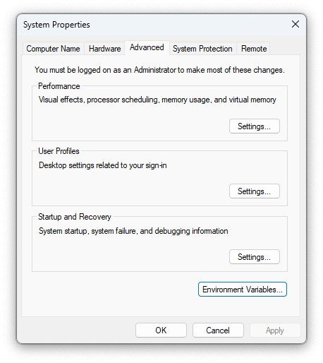
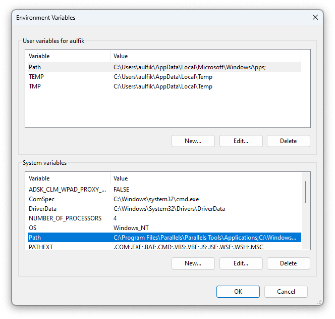
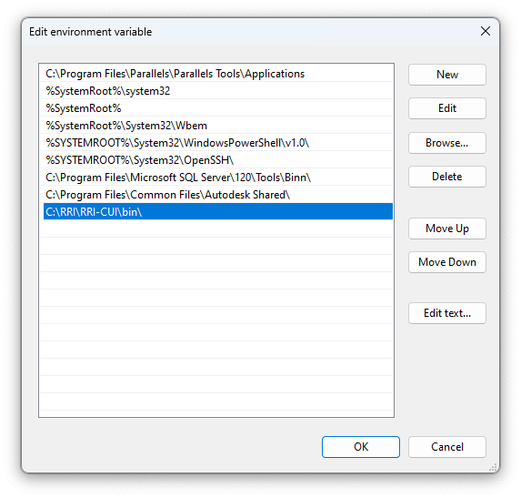

# Supplementary *Rainfall-Runoff-Inundation Model* 

Untuk melihat full teks tulisan dapat diakses di  [digilib.unila.ac.id](http://digilib.unila.ac.id/id/eprint/72609) serta artikel ilmiah [dalam proses].

Aulia, Fikri (2023) *ANALISIS BANJIR DENGAN MENGGUNAKAN RAINFALL-RUNOFF-INUNDATION (RRI) MODEL DI DAS SEKAMPUNG, PROVINSI LAMPUNG*. Masters thesis, UNIVERSITAS LAMPUNG.

Semoga Membantu! Penerapan *Open Science* dalam penelitian ini semoga dapat terwujudkan.

## Pendahuluan

Pemodelan genangan banjir *Rainfall-Runoff-Inundation (RRI)* digunakan untuk DAS Sekampung, Provinsi Lampung.

Penggunaan model ini harus tunduk dan patuh pada ketentuan sumber [lihat disini.](https://www.pwri.go.jp/icharm/research/rri/rri_top.html) Serta memahami *Terms of Use Agreement for the Rainfall-Runoff-Inundation Model Program* yang dapat dibaca saat mengunduh program ini. 

>*RRI model program is owned by the International Centre for Water-related Hazard and Risk Management of the Public Works Research Institute (ICHARM-PWRI) in the publication or distribution of calculation results acquired by the use of the RRI model program.*

Untuk dapat dengan mudah mengerti tentang hal-hal dalam penguunaan model ini, disarankan untuk membaca dan memahami [RRI Manual](https://www.pwri.go.jp/icharm/research/rri/rri_top.html). Sehingga dapat mengetahui *Model Structure Overview,* *Governing Equations of RRI Model,* *One-dimensional River Routing Model,* *River and Slope Water Exchange* dan *Numerical Scheme* dalam model ini.

## Panduan Persiapan

Setelah mengunduh program [RRI Model](https://www.pwri.go.jp/icharm/research/rri/rri_top.html), membaca RRI Manual, RRI_Papers dan program RRI yang tersedia. Dalam tulisan ini akan lebih di jelaskan tentang *RRI-CUI*. Karena model ini ditulis dalam bahasa pemograman Fortran90 maka ada beberapa hal yang harus dipersiapkan dalam penggunaannya. 

Seperti disampaikan dalam Manual RRI:  
Untuk pengguna _**Windows**_ dapat mengikuti langkah persiapan sebagai berikut:  
    1. Lakukan *unzip* file telah diunduh **"RRI_1_4_2_x.zip"** dalam direktori kerja, misal C:\   
    2. Menambahkan PATH dari RRI-CUI folder dengan mengatur *Enviroment Variables* pada sistem operasi, cara tercepat adalah ketik `systempropertiesadvanced` atau `env` di *Start* menu dan tekan Enter  
      
    3. Klik *Enviroment Variables*, klik *Edit* untuk memodifikasi PATH ini
      
    4. Menambahkan `C:\RRI\RRI-CUI\bin\` (untuk 64 bit) atau `C:\RRI\RRI-CUI\bin32\` (untuk 32 bit) pada baris belakang, klik OK. **JANGAN MENGHAPUS existing PATH settings**
    .   

Sesungguhnya ntuk pengguna _**MacOS/linux/Windows**_ secara lengkap dapat diunduh pada [Intel® Fortran Compiler](https://www.intel.com/content/www/us/en/developer/tools/oneapi/fortran-compiler.html#gs.6hhzgj) mengikuti langkah install dan penggunaan [Compiler Setup](https://www.intel.com/content/www/us/en/docs/fortran-compiler/developer-guide-reference/2023-2/compiler-setup.html). Namun akan dijelaskan secara singkat dibawah ini.

Menginstall Intel Fortran pada sistem operasi yang digunakan, hal ini diperlukan untuk menjalankan program RRI yang dikompilasi oleh Intel Fortran.   

Untuk pengguna _**Windows**_ dapat mengikuti langkah berikut:  
    1. Jalankan **RRI/RRI-CUI/etc/w-fcompxe/w_fcompxe_redist_intel64_2013.5.198.msi** (untuk 64 bit) atau **RRI/RRI-CUI/etc/w-fcompxe/w_fcompxe_redist_ia32_2013.5.198.msi** (untuk 32 bit), berkas ini tersedia pada paket unduhan program RRI.    

`sudo chmod a+rwx l_fortran-compiler_p_2023.2.1.8.sh`   
`./l_fortran-compiler_p_2023.2.1.8.sh`

## Data

### Data Topografi

### Data Hujan

## Ucapan Terimakasih

Dr. Ofik Taufik Purwadi, S.T., M.T.  
Ir. Ahmad Zakaria, M.T., Ph.D.  
Dr. Endro P. Wahono, S.T., M.T.  
Prof. Dr. Dyah Indriana Kusumastuti, S.T., M.Sc.  
